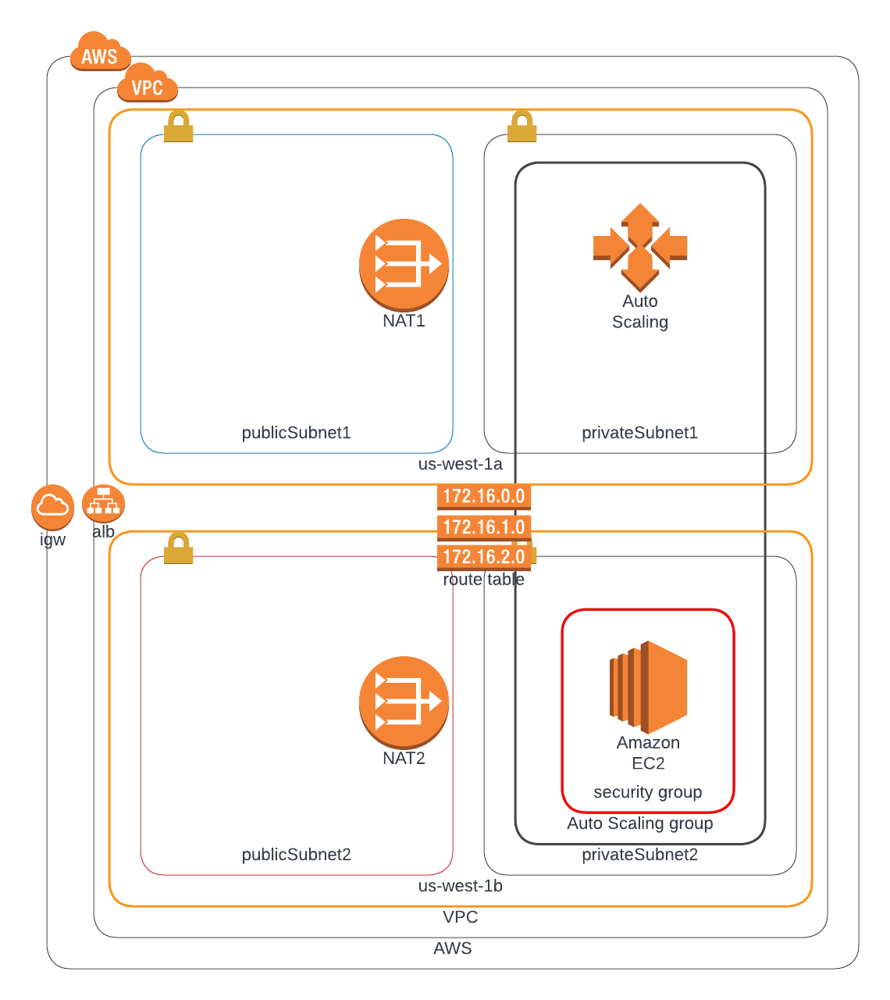
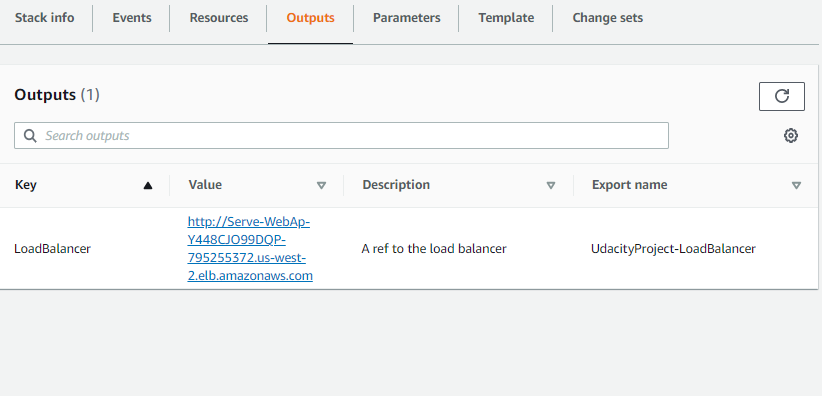
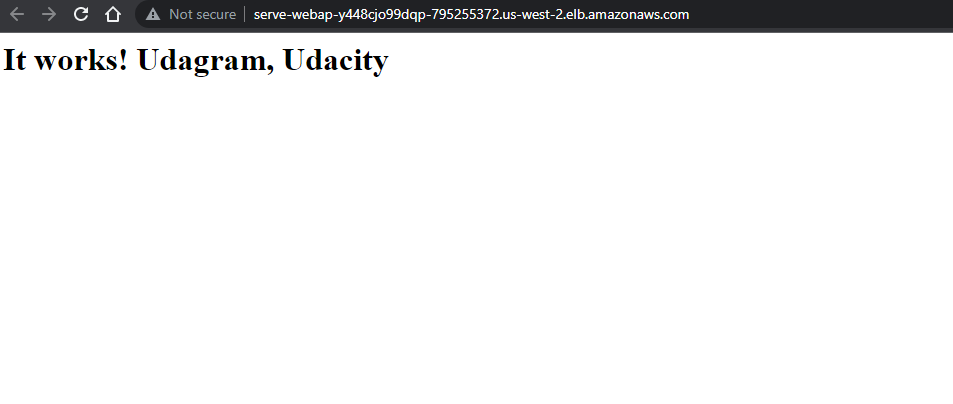

## Deploy a High Availability web app using CloudFormation

## In this repo
### HA_template_network.yml
Template containing all the network resources to be deployed. Deploy this first.

### HA_template_server.yml
Template containing all the app resources to be deployed. Deploy this after deploying the network resources.

### HA_params.json
Parameters that you can tweak to customise:
- <strong>EnvironmentName</strong>: The EnvironmentName you want to use for the deployment
- <strong>VpcCIDR</strong>: The CIDR of your VPC
- <strong>PublicSubnet1CIDR/PublicSubnet2CIDR/PrivateSubnet1CIDR/PrivateSubnet2CIDR</strong>: The - CIDR of your public and private subnets

### infrastructure_diagram.png
The infrastructure Diagram

## Prerequisites
A user account with programmatic access to AWS

## To run

Create network stack using the following command:  
`aws cloudformation create-stack --stack-name NetworkStack --template-body file://HA_template_network.yml --parameters file://HA_params.json`  

Wait a few minutes for the stack creation to complete. Check the status with `aws cloudformation list-stacks --stack-status-filter CREATE_COMPLETE` 

Create the server stack:  
`aws cloudformation create-stack --stack-name ServerStack --template-body file://HA_template_server.yml --parameters file://HA_params.json`  

## Output
The IP address of the load balancer (among other results)  
In this case http://serve-webap-y448cjo99dqp-795255372.us-west-2.elb.amazonaws.com/

  
